# zlog Architecture

> **zlog** is a 6 000+ line, self-contained structured logging framework for Zsh.  
> It is designed to be sourced once and provides a full production-grade logging system with levels, file rotation, buffering, async I/O, context loggers, rate limiting, benchmarking, and color output — all with zero external dependencies beyond a standard Zsh 5.3+ installation.

---

## Table of Contents

1. [High-Level Overview](#1-high-level-overview)
2. [Module Map](#2-module-map)
3. [Global State Model](#3-global-state-model)
4. [Initialization Sequence](#4-initialization-sequence)
5. [Log Level System](#5-log-level-system)
6. [Core Engine](#6-core-engine)
7. [Formatter Pipeline](#7-formatter-pipeline)
8. [Color System](#8-color-system)
9. [Timestamp System](#9-timestamp-system)
10. [File I/O & Rotation](#10-file-io--rotation)
11. [Buffering System](#11-buffering-system)
12. [Async Logging](#12-async-logging)
13. [Context Logging](#13-context-logging)
14. [Benchmarking System](#14-benchmarking-system)
15. [Rate Limiting & Once Logging](#15-rate-limiting--once-logging)
16. [Control-Flow Helpers](#16-control-flow-helpers)
17. [Configuration Management](#17-configuration-management)
18. [Cleanup & Resource Management](#18-cleanup--resource-management)
19. [Performance Mode](#19-performance-mode)
20. [Public API Reference](#20-public-api-reference)
21. [Data Flow: End-to-End](#21-data-flow-end-to-end)
22. [Naming Conventions](#22-naming-conventions)
23. [Design Principles](#23-design-principles)

---

## 1. High-Level Overview

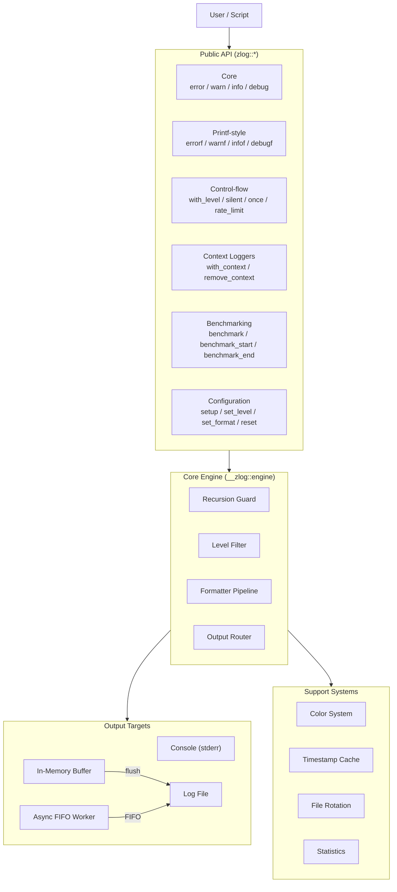

---

## 2. Module Map

The file is organized into 20 sequential sections. Each section is self-contained and depends only on sections above it.


---

## 3. Global State Model

All global variables are declared with `if (( ! ${+var} ))` guards, making the file **safely re-sourceable** without resetting live state.

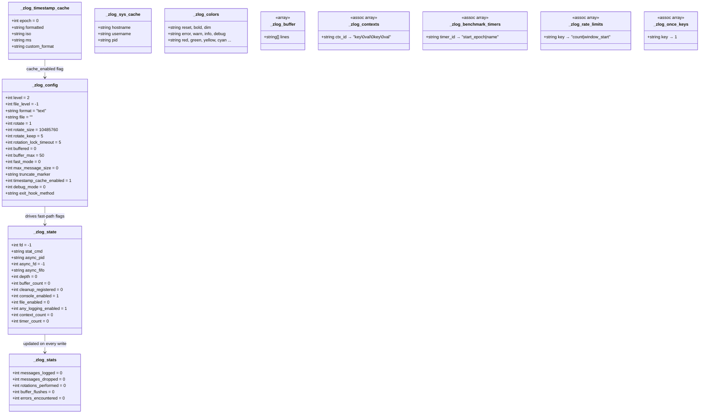

### Fast-Path Flags

`__zlog::update_fast_flags` pre-computes three booleans into `_zlog_state` so every public log call can do a single integer check as its very first operation:

| Flag | Formula |
|---|---|
| `console_enabled` | `_zlog_config[level] >= 0` |
| `file_enabled` | `${#_zlog_config[file]} > 0` |
| `any_logging_enabled` | `console_enabled OR file_enabled` |

---

## 4. Initialization Sequence

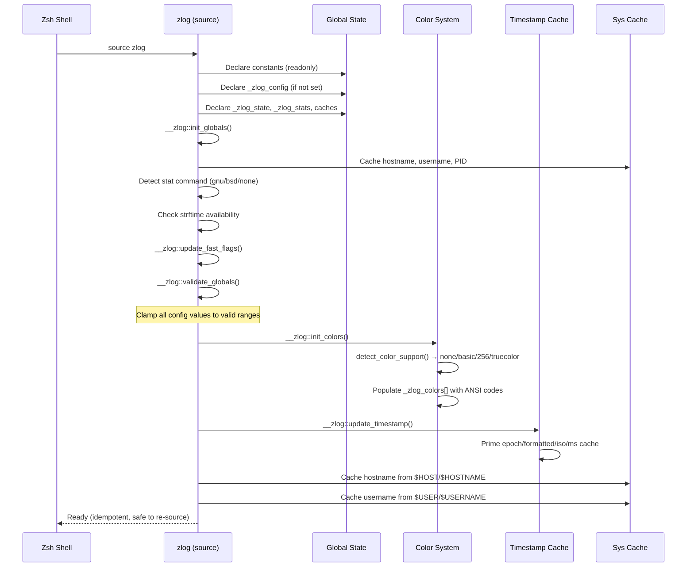

---

## 5. Log Level System

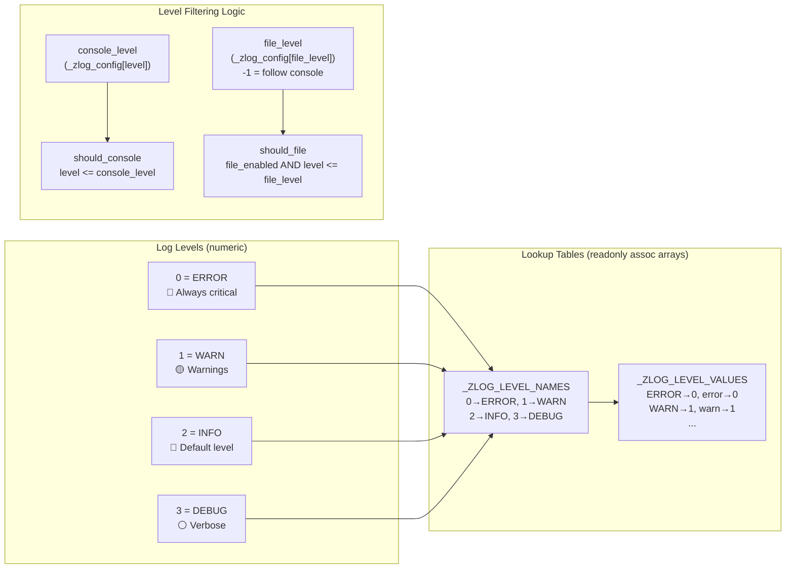

**File level special value:** `-1` (or `"console"`) means the file always follows the console level. This is the default.

---

## 6. Core Engine

The engine is the single central function that all public log calls delegate to. It is the only place where output decisions are made.

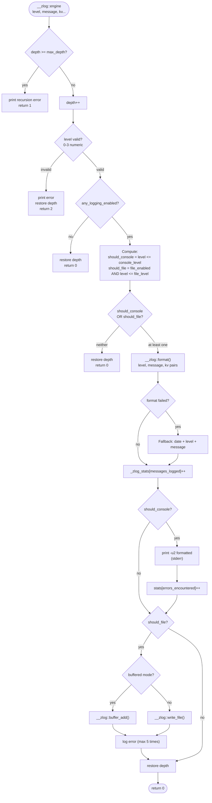

### Engine Variants

| Variant | Function | Speed | Safety |
|---|---|---|---|
| Normal | `__zlog::engine` | ~100–200µs | Full recursion guard, validation, error handling |
| Fast | `__zlog::engine_fast` | ~50–80µs | No recursion guard, no validation, no error handling |

Performance mode hot-swaps the engine at runtime by copying function bodies:
```zsh
functions[__zlog::engine_original]="${functions[__zlog::engine]}"
functions[__zlog::engine]="${functions[__zlog::engine_fast]}"
```

---

## 7. Formatter Pipeline

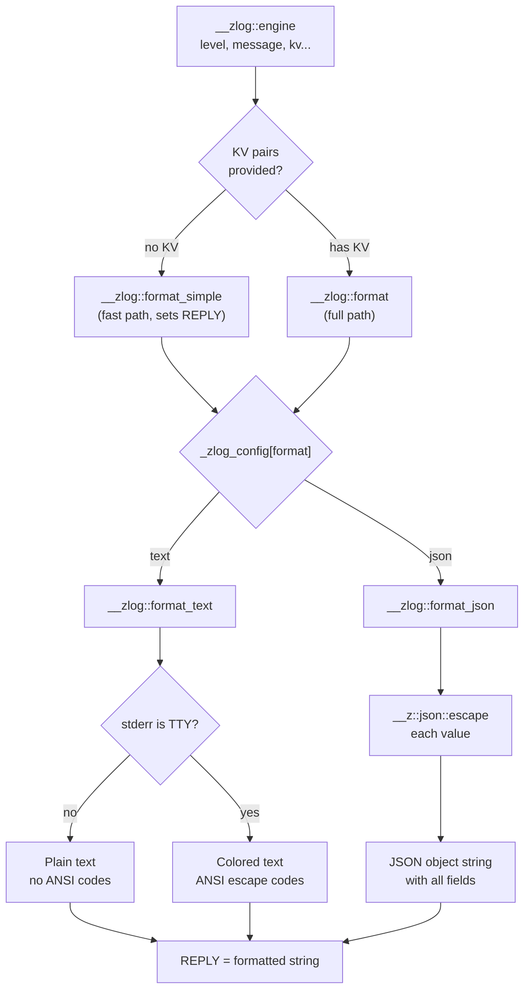

### Text Format Output

```
2026-03-15 14:23:01 [INFO ] (1234) Message text | key=value key2=value2
│─────────────────│ │─────│ │────│ │───────────│   │──────────────────│
  dim timestamp     bold    dim    message text      context KV pairs
                   colored  PID                      key=dim, val=cyan
```

Level names are right-padded to 5 characters for column alignment (`INFO `, `WARN `, `ERROR`, `DEBUG`).

### JSON Format Output

```json
{
  "timestamp": "2026-03-15T14:23:01Z",
  "level":     "INFO",
  "message":   "Message text",
  "hostname":  "myhost",
  "pid":       1234,
  "user":      "alice",
  "key":       "value",
  "key2":      "value2"
}
```

Reserved JSON field names (`timestamp`, `level`, `message`, `hostname`, `pid`, `user`) are **rejected** as context keys. Invalid characters are stripped by `__zlog::sanitize_context_key`.

---

## 8. Color System

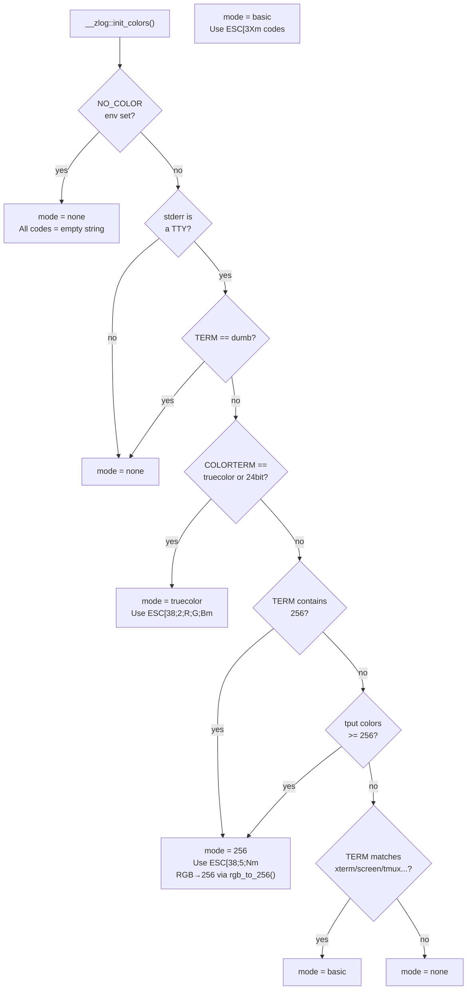

### Color Slots

| Slot | Purpose |
|---|---|
| `reset`, `bold`, `dim`, `underline` | Text attributes |
| `error`, `warn`, `info`, `debug`, `success` | Semantic level colors |
| `red`, `green`, `yellow`, `blue`, `magenta`, `cyan`, `white` | Named colors |
| `bright_*` | Bright variants |
| `bg_*` | Background variants |

In truecolor/256 mode, colors are defined as specific RGB values (e.g., red = `205,49,49`) for visual consistency across terminals.

---

## 9. Timestamp System

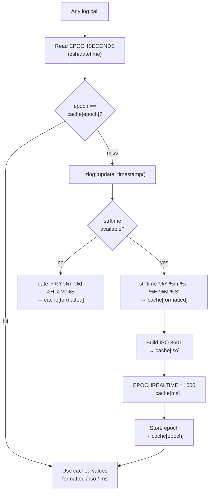

**Cache key:** `EPOCHSECONDS` (integer seconds). Within the same second, all log calls share the same formatted timestamp — zero repeated `strftime` calls.

**Available timestamp formats:**

| Key | Example | Use |
|---|---|---|
| `formatted` | `2026-03-15 14:23:01` | Human-readable (default) |
| `iso` | `2026-03-15T14:23:01Z` | JSON output |
| `ms` | `1705329781234` | Millisecond epoch |
| `epoch` | `1705329781` | Integer epoch |

Custom format: `zlog::set_timestamp_format "%H:%M:%S"` — validated with a test `strftime` call before accepting.

---

## 10. File I/O & Rotation

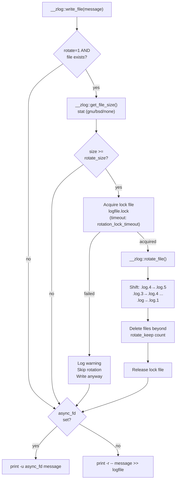

### `stat` Command Detection

On init, zlog auto-detects which `stat` variant is available:

| Priority | Command | Flag |
|---|---|---|
| 1 | `gstat` (GNU coreutils on macOS) | `-c%s` |
| 2 | `stat -f%z` | BSD (macOS native) |
| 3 | `stat -c%s` | GNU (Linux) |
| 4 | none | Rotation disabled |

### Rotation Naming

```
app.log          ← current (always written here)
app.log.1        ← most recent backup
app.log.2
...
app.log.N        ← oldest (N = rotate_keep, default 5)
```

Files beyond `rotate_keep` are deleted. The lock file (`app.log.lock`) prevents concurrent rotation from multiple processes.

---

## 11. Buffering System

```mermaid
stateDiagram-v2
    [*] --> Unbuffered : default

    Unbuffered --> Buffered : zlog::enable_buffering [size]
    Buffered --> Unbuffered : zlog::disable_buffering

    state Buffered {
        [*] --> Accumulating
        Accumulating --> AutoFlush : level==ERROR OR count>=buffer_max
        Accumulating --> ManualFlush : zlog::flush
        Accumulating --> ExitFlush : process exit / signal
        AutoFlush --> Accumulating : buffer cleared
        ManualFlush --> Accumulating : buffer cleared
        ExitFlush --> [*]
    }
```

**Flush mechanism:** A single `printf '%s\n' "${_zlog_buffer[@]}"` bulk write — far more efficient than per-line `>>` appends.

**Exit hook registration** (tries in order, uses first that works):
1. `add-zsh-hook zshexit` (preferred, Zsh native)
2. `TRAPEXIT` function
3. `trap ... EXIT`

All three also register `INT TERM HUP QUIT` signal handlers to flush on abnormal termination.

---

## 12. Async Logging

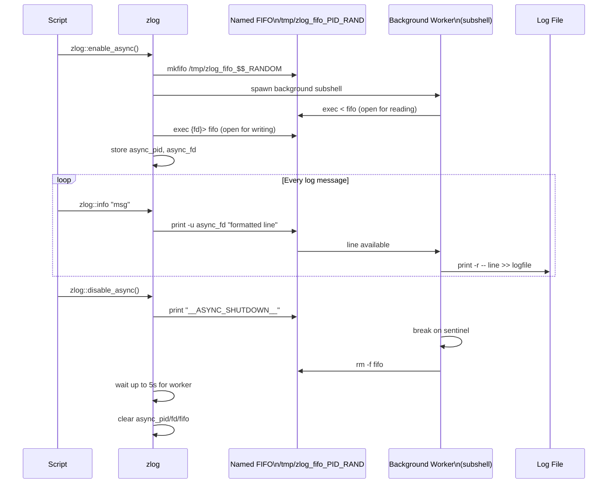

> **Note:** Async logging is marked experimental. It adds throughput for high-volume file logging but introduces complexity (FIFO lifecycle, worker crash handling).

---

## 13. Context Logging

Context loggers attach a fixed set of key-value pairs to every log call, without repeating them at each call site.

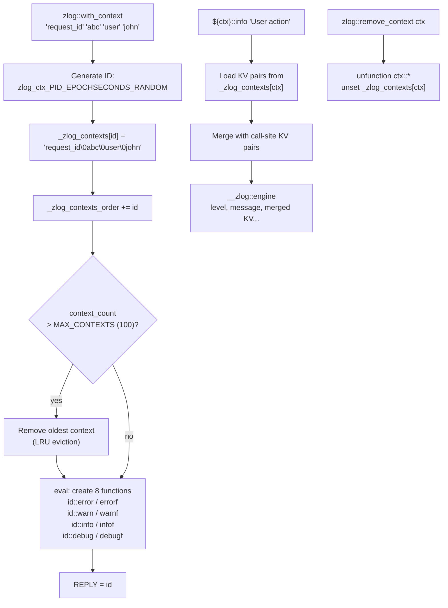

### Context Storage Format

Context KV pairs are stored as a null-byte (`\0`) separated string:
```
"request_id\0abc123\0user\0john\0session\0xyz"
```
This avoids nested arrays and is split at call time with `${(s:\0:)ctx_string}`.

---

## 14. Benchmarking System

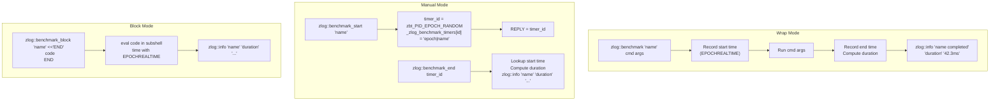

**Duration formatting:**

| Range | Format | Example |
|---|---|---|
| < 1ms | microseconds | `842µs` |
| < 1s | milliseconds | `42.3ms` |
| < 60s | seconds | `3.14s` |
| ≥ 60s | minutes + seconds | `2m 5.30s` |

All benchmark functions are **no-ops** when the INFO level is disabled — zero overhead in production.

---

## 15. Rate Limiting & Once Logging

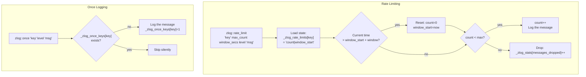

---

## 16. Control-Flow Helpers

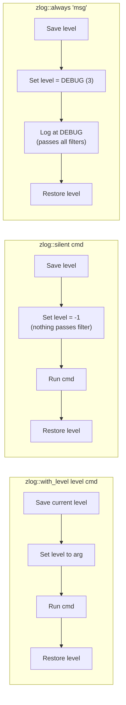

All three helpers save and restore `_zlog_config[level]` around the wrapped call, making them safe for nested use.

---

## 17. Configuration Management

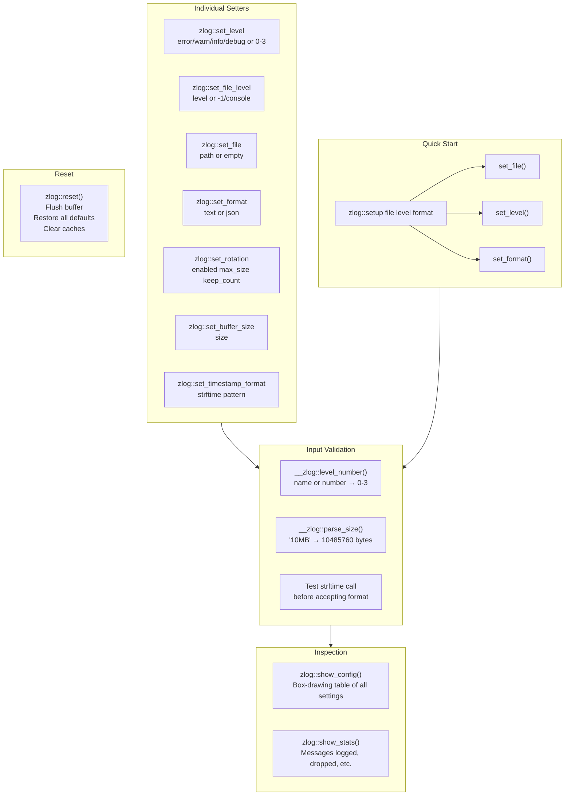

### Size Parsing (`__zlog::parse_size`)

Accepts human-readable sizes and converts to bytes:

| Input | Bytes |
|---|---|
| `1024` | 1 024 |
| `10KB` | 10 240 |
| `10MB` | 10 485 760 |
| `1GB` | 1 073 741 824 |
| `500TB` | 549 755 813 888 000 |

---

## 18. Cleanup & Resource Management

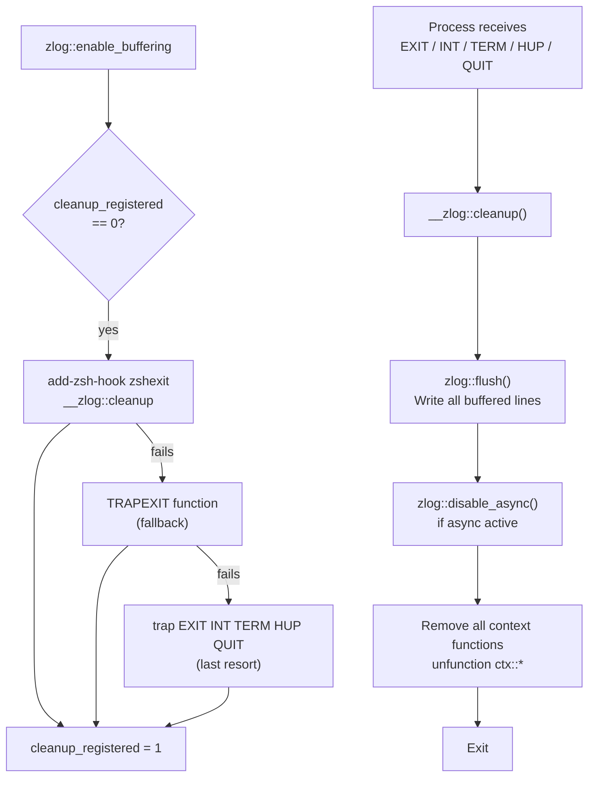

---

## 19. Performance Mode

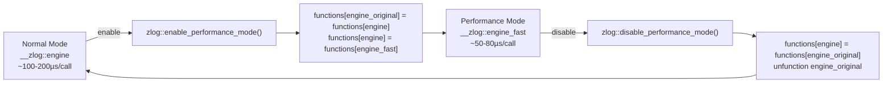

**What the fast engine skips:**

| Check | Normal Engine | Fast Engine |
|---|---|---|
| Recursion depth guard | ✅ | ❌ |
| Level range validation | ✅ | ❌ |
| Format error handling | ✅ | ❌ |
| Fallback formatting | ✅ | ❌ |
| Statistics tracking | ✅ | ❌ |
| `format_simple` for no-KV | ✅ | ✅ |
| Buffer auto-flush on ERROR | ✅ | ✅ |

---

## 20. Public API Reference

### Naming Convention

```
zlog::<verb>          Public API  (user-facing)
__zlog::<verb>        Private     (internal, do not call directly)
```

### Core Logging

```zsh
zlog::error  "message" [key val ...]
zlog::warn   "message" [key val ...]
zlog::info   "message" [key val ...]
zlog::debug  "message" [key val ...]
zlog::log    "level" "message" [key val ...]   # level by name or number
```

### Printf-style

```zsh
zlog::errorf "format %s %d" arg1 arg2
zlog::warnf  "format %s %d" arg1 arg2
zlog::infof  "format %s %d" arg1 arg2
zlog::debugf "format %s %d" arg1 arg2
```

### Control Flow

```zsh
zlog::with_level  debug  my_function [args]
zlog::silent             my_function [args]
zlog::always      "Critical message"
zlog::once        "unique-key"  info  "message"
zlog::rate_limit  "key"  max_count  window_secs  level  "message"
```

### Context Loggers

```zsh
zlog::with_context "key1" "val1" "key2" "val2"
local ctx="$REPLY"
${ctx}::info   "message" [extra_key extra_val ...]
${ctx}::infof  "format %s" arg
${ctx}::error / warn / debug / errorf / warnf / debugf
zlog::remove_context "$ctx"
```

### Benchmarking

```zsh
zlog::benchmark        "label"  command [args]
zlog::benchmark_start  "label"  ;  timer="$REPLY"
zlog::benchmark_end    "$timer"
zlog::benchmark_block  "label"  <<'END'
  # code block
END
```

### Configuration

```zsh
zlog::setup              "/path/to/app.log"  [level]  [format]
zlog::set_level          error|warn|info|debug|0-3
zlog::set_file_level     error|warn|info|debug|0-3|-1|console
zlog::set_file           "/path/to/app.log"
zlog::set_format         text|json
zlog::set_rotation       0|1  [max_size]  [keep_count]
zlog::enable_buffering   [buffer_size]
zlog::disable_buffering
zlog::set_buffer_size    N
zlog::set_timestamp_format  "%Y-%m-%d %H:%M:%S"
zlog::show_config
zlog::show_stats
zlog::reset
zlog::flush
```

### Async

```zsh
zlog::enable_async
zlog::disable_async
zlog::is_async            # returns 0 if active
```

### Performance

```zsh
zlog::enable_performance_mode
zlog::disable_performance_mode
```

---

## 21. Data Flow: End-to-End

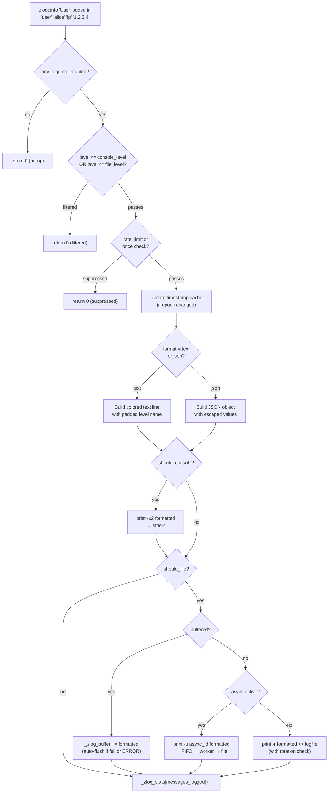

---

## 22. Naming Conventions

| Pattern | Meaning | Example |
|---|---|---|
| `zlog::<verb>` | Public API | `zlog::info` |
| `__zlog::<verb>` | Private internal | `__zlog::engine` |
| `__z::json::<verb>` | JSON utilities | `__z::json::escape` |
| `_zlog_<name>` | Global state variable | `_zlog_config` |
| `_ZLOG_<NAME>` | Readonly constant | `_ZLOG_LEVEL_INFO` |
| `zlog_ctx_PID_TS_RAND` | Context logger ID | `zlog_ctx_1234_1705329781_42` |
| `zbt_PID_TS_RAND` | Benchmark timer ID | `zbt_1234_1705329781_7` |

---

## 23. Design Principles

| Principle | Implementation |
|---|---|
| **Zero external dependencies** | Only `zsh/datetime` (optional), `tput`, `stat`, `date` as fallbacks |
| **Safe re-sourcing** | All globals guarded with `${+var}` checks |
| **No subshell for return values** | `REPLY` convention — avoids fork overhead |
| **Option isolation** | Every function uses `emulate -L zsh` + `setopt localoptions` |
| **Recursion safety** | `_zlog_state[depth]` counter, always restored in all code paths |
| **NO_COLOR compliance** | Respects the standard `NO_COLOR` environment variable |
| **Error suppression** | File write errors printed for first 5 occurrences, then silenced |
| **Graceful degradation** | Missing `stat` → no rotation; missing `strftime` → `date` fallback; no TTY → no colors |
| **Performance first** | Timestamp cache, fast-path flags, fast engine, `format_simple`, bulk flush |
| **Idempotent init** | `_zlog_initialized` flag prevents double-init work |
